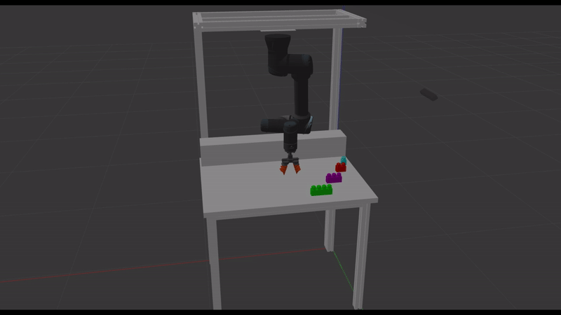

<p align='center'>
    <h1 align="center">Project of Fundamentals of Robotics</h1>
    <p align="center">
    Project of Fundamental of Robotics course at the University of Trento A.Y. 2023/2024
    </p>
</p>

## Table of contents

+ [Introduction](#introduction)
+ [Project structure](#project-structure)
+ [Installation](#installation)
+ [How to run the project](#how-to-run-the-project)
  - [Setup](#setup)
  - [Running](#running)
+ [Known Issues](#known-issues)

## Introduction
A number of blocks are stored without any specific order on a stand located within the workspace of a robotic manipulator (Ur5). The manipulator is an anthropomorphic arm, with a spherical wrist and a two-fingered gripper as end-effector. Objects can belong to different classes but have a known geometry. The goal of the project is to use the manipulator to pick the objects in sequence and to position them on a different location according to a specified order. A calibrated 3D camera is used to locate the different objects and to detect their position in the stand.



## Project structure
+ **Motion planner **
  - contains the catkin project for the motion planner and the task manager
  - `include` has the header files
  - `msg` has block's information
  - `source` has the source files
  - `CMakeLists.txt` is the CMake file for the project
  - `package.xml` is the package file for the project
+ **Vision **
  - contains the visions scripts and weights
  - `dataset` contains the blocks' dataset
  - `models` contains the block's models
  - `scripts` has the scripts for the vision
  - `weights` has the weights of neural layers
  - `tavolo_brick.world` is the .world template

## Installation
The project has been developed and tested on Ubuntu 20.04 with ROS Noetic, also we used the [locosim](https://github.com/mfocchi/locosim) repository for the ur5 simulation. The installation of the project is the following:
1) Clone the [locosim](https://github.com/mfocchi/locosim) repository and follow the instructions to install it
2) Clone this repository in the /ros_ws/src folder:
```BASH
cd ~/ros_ws/src
git clone https://github.com/andreapedrini01/FoR-project/
```
3) Copy the .world file of the repository in the worlds folder
```BASH
cd ~/ros_ws/src/FoR-project/
cp tavolo_brick.world ~/ros_ws/src/locosim/ros_impedance_controller/worlds
```
4) Copy the models in the models folder
```BASH
cd ~/ros_ws/src/FoR-project/vision/models
cp -r X1-Y1-Z2 X1-Y2-Z2 X1-Y3-Z2 X1-Y4-Z2 ~/ros_ws/src/locosim/ros_impedance_controller/worlds/models
```

5) Compile the project in the ros_ws folder:
```BASH
cd ~/ros_ws
catkin_make install
source install/setup.bash
```
6) Write in terminal
```BASH
cd ~/ros_ws/src/locosim/robot_control/base_controllers
gedit ur5_generic.py
```
7) Go to line 71 and change the line in
```BASH
self.world_name = "tavolo_brick.world"
```
8) write in terminal
```BASH
pip install ultralytics
```

## How to run the project
1) Run the Ur5_generic.py file
2) Open an other terminal and run the taskManager
```BASH
rosrun motion taskManager
``` 
3) Open an other terminal and run the motionPlanner
```BASH
rosrun motion motionPlanner
```
4) Open an other terminal and run the vision node in the correct folder:
```BASH
cd ~/ros_ws/src/FoR-project/vision/scripts
python3 Vision.py
```
5) Now it will appear on terminal
```BASH
Continue  (ENTER)
```
6) Press `ENTER` to continue or `1+ENTER` to repeat the object detection

## Known Issues

## Contributors
<p align = 'center'>
  Lorenzo Pieropan [217869] <br>
  Federico Buzzini [227670] <br>
  Andrea Gravili [228055] <br>
  Andrea Pedrini [226607]
</p>

